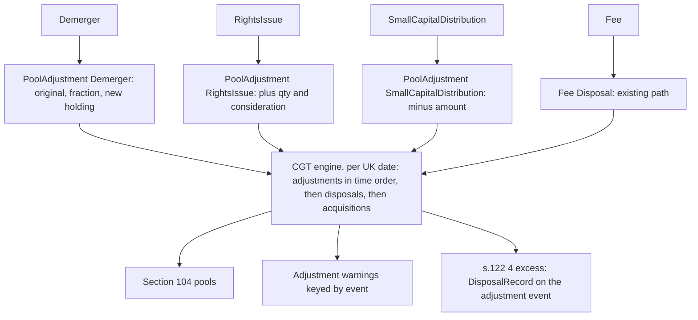

# Share Reorganisation and Fee Inputs - Plan

## Goal Capsule

- **Objective:** A taxc user can record a demerger, a small capital distribution, a rights issue and a fee paid in tokens. taxc then computes Section 104 pools and gains the way HMRC treats each of them: no disposal for the first three, and a disposal at market value for the fee. A producer such as akku no longer has to leave these events out of the document or approximate them.
- **Means:** four new input transaction types named after their HMRC concepts (KTD1). Demerger, RightsIssue and SmallCapitalDistribution feed one new pool-adjustment event that the CGT engine applies to the pool directly (KTD2, KTD3). Fee reuses the existing fee-disposal path (KTD5).
- **Authority:** this plan's Product Contract, then its Planning Contract. The taxc `AGENTS.md` rules (TDD, the test pyramid, README for any input change, generated schemas) override both.
- **Stop conditions:**
  - Stop and ask if an HMRC source cited here contradicts the treatment a requirement states.
  - Stop and ask before tagging or publishing a release (U6).
- **Execution profile:** test-first, with domain logic proven in `src/core/` unit tests and the CLI and report wiring in `tests/`.
- **Tail ownership:** the implementer runs the Verification Contract, opens the PR, and adds its URL to tsk T147. The release tag waits for operator approval after merge. akku's pin bump and mapping are akku T67 (U8, U12 there).

---

## Product Contract

### Summary

Add four transaction types to the input document: `Demerger`, `SmallCapitalDistribution`, `RightsIssue` and `Fee`. The first three change a Section 104 pool without a disposal and are never matched under the same-day or 30-day rules. `Fee` disposes of the tokens spent on a fee at market value. Reports and `taxc pools` show the pool changes. The README, the generated schemas and CONCEPTS name each type with its HMRC source and the cases it covers.

### Problem Frame

taxc's input has three transaction types: Trade, Deposit and Withdrawal. None of them can change a pool's cost without units leaving it, or add units as though already held. So a producer cannot express:

- a demerger, where part of the original shares' cost moves to the new holding with no disposal;
- a small capital distribution, which reduces allowable cost instead of being a disposal;
- a rights issue, whose shares join the existing holding rather than being a new acquisition;
- a fee paid in tokens when nothing else moves.

akku's ledger has live cases of each: ULVR→MICC (2025-12-17), ULVR consolidation cash (£21.64), CSN rights (2025-07-18) and 112 fee-only DOT transactions. Today akku leaves them out of the document or approximates them, and its users see an incomplete return.

### Requirements

**Share reorganisations (no disposal)**

- R1. A `Demerger` moves a stated fraction of the original shares' pool cost to the pool of the new holding, and adds the new holding's quantity. It is not a disposal, and the new holding is treated as held since the original shares were. It covers demergers the company's tax guidance treats as a share reorganisation: an exempt distribution (TCGA 1992 s.192; CTA 2010 s.1076) or a scheme of reconstruction (TCGA 1992 s.136). The cost is apportioned by market value on the first dealing day (s.130). HMRC: [CG45620](https://www.gov.uk/hmrc-internal-manuals/capital-gains-manual/cg45620), [CG51702](https://gov.uk/hmrc-internal-manuals/capital-gains-manual/cg51702), [CG51890](https://www.gov.uk/hmrc-internal-manuals/capital-gains-manual/cg51890), [CG52742](https://gov.uk/hmrc-internal-manuals/capital-gains-manual/cg52742). A demerger taxed as a dividend in specie is not a `Demerger`: record it as an income Deposit of the new shares at market value.
- R2. A `RightsIssue` adds its quantity and its consideration (plus any GBP fee) to the existing pool as part of the original holding. It is not an acquisition, so no disposal is ever matched against it under the same-day or 30-day rules (TCGA 1992 s.126(2)(a), s.127, s.128; HMRC [CG51746](https://gov.uk/hmrc-internal-manuals/capital-gains-manual/cg51746), [CG51590](https://www.gov.uk/hmrc-internal-manuals/capital-gains-manual/cg51590)). It covers only the take-up of the holder's own pro-rata entitlement in the same company. Shares from purchased rights or excess applications, and rights to shares in another company ([CG52065](https://gov.uk/hmrc-internal-manuals/capital-gains-manual/cg52065)), are a Trade acquisition.
- R3. A `SmallCapitalDistribution` deducts the amount distributed from the pool's allowable cost, with no disposal (TCGA 1992 s.122(2); HMRC [CG57835](https://www.gov.uk/hmrc-internal-manuals/capital-gains-manual/cg57835)). This includes cash for fractional entitlements on a reorganisation (s.128(3); HMRC [CG57855](https://gov.uk/hmrc-internal-manuals/capital-gains-manual/cg57855)). Choosing the type is the producer's assertion that the distribution is small. HMRC's practice is 5% or less of the holding's value, or £3,000 or less, and otherwise case by case.
- R4. When a `SmallCapitalDistribution` exceeds the pool's allowable cost, the pool cost becomes zero and the excess is a chargeable gain, the treatment under a s.122(4) election (HMRC [CG57847](https://www.gov.uk/hmrc-internal-manuals/capital-gains-manual/cg57847)). The gain carries a warning that it assumes the election. It counts in gains and the SA108 totals, and is shown on the distribution's row.
- R5. On any one UK date, `Demerger`, `RightsIssue` and `SmallCapitalDistribution` apply to the pools before any disposal is matched. So a disposal of the new holding on the demerger date draws its cost from the new pool. Several adjustments on one date apply in transaction time order. Ties go rights issue, then demerger, then small capital distribution.
- R6. A `Demerger` or `SmallCapitalDistribution` against an asset with no pool carries a warning. The demerger still adds the new holding's quantity, at whatever cost the fraction yields. The distribution's excess follows R4.

**Fees**

- R7. A `Fee` transaction disposes of its fee tokens at market value, with no allowable cost added to any other disposal. Paying for a service with tokens is a disposal (HMRC [CRYPTO22100](https://gov.uk/hmrc-internal-manuals/cryptoassets-manual/crypto22100)), valued at market value as for a fee paid in tokens ([CRYPTO22280](https://gov.uk/hmrc-internal-manuals/cryptoassets-manual/crypto22280)). A GBP fee produces no event.

**Reporting and contract**

- R8. Pool adjustments appear in `taxc pools` history, in event listings and in the HTML report's event list, labelled with their transaction type. Apart from the R4 gain, they never count as disposals, acquisitions or income in any total, including the SA108 figures. Their warnings reach the report rows and the library's results.
- R9. The README, `schema/*.json` (regenerated) and CONCEPTS describe each new type with its HMRC source and the cases it covers (R1–R3, R7). The library's `input` and `results` modules export the new types.

### Key Decisions

- **A demerger carries the apportionment fraction, not a GBP figure.** (session-settled: user-approved — chosen over an absolute GBP cost: taxc's pool can differ from the producer's, for example after 30-day matching, and companies publish the split as a proportion.) Governs R1.
- **Qualifying conditions are documented, not asserted by extra fields.** Choosing a type is the producer's assertion. (session-settled: user-approved — chosen over explicit assertion fields.) Governs R1–R3, R9.
- **An over-cost small distribution applies s.122(4) with a warning.** (session-settled: user-approved — chosen over rejecting the document or requiring an election flag: it is the only outcome taxc can compute without valuing the remaining holding.) Governs R4.
- **A thin or missing pool warns and continues.** (session-settled: user-approved — chosen over blocking the document, consistent with taxc's existing insufficient-cost-basis warning.) Governs R6.
- **Conversions (s.135 share-for-share exchanges) are out of scope.** akku counts them for manual handling. (session-settled: user-directed — chosen over a NoGainNoLoss approximation.)
- **No unit change at constant cost.** akku adjusts earlier acquisitions for splits and consolidations itself. (session-settled: user-approved.)
- **A rights issue is a reorganisation, not a dated purchase.** (session-settled: user-directed — chosen over keeping it a purchase.) Governs R2.
- **Fee-only transactions are fee disposals.** (session-settled: user-directed — chosen over leaving them unexported, so a clean akku export can exit 0.) Governs R7.
- **Names follow HMRC terminology.** Transaction types and concept entries use the manual's terms: demerger, rights issue, small capital distribution, fee. (session-settled: user-directed.) Governs R9.

### Acceptance Examples

- AE1. **Covers R1, R5.** 887 ULVR bought for £36,995.24. A `Demerger` on 2025-12-17 moves fraction 0.051151 to 177 MICC (£1,892.34 at pence rounding). 177 MICC are sold the same day for £2,160.65 with a £3.98 fee. The MICC disposal matches the pool, and its gain is £2,160.65 − £3.98 − the moved cost. ULVR's pool keeps 887 units, its cost reduced by the moved amount. No disposal of ULVR is recorded.
- AE2. **Covers R2.** 3,800 CSN bought on 2024-04-10 for £10,665.00. 1,000 CSN sold on 2025-07-08. A `RightsIssue` of 1,473 CSN (10 for every 19 of the remaining 2,800) for £2,592.48 on 2025-07-18. The 2025-07-08 sale matches the pool, not the rights shares. The pool afterwards holds 4,273 CSN at the remaining pool cost plus £2,592.48.
- AE3. **Covers R3, R4.** A `SmallCapitalDistribution` of £21.64 on ULVR reduces its pool cost by £21.64, with no disposal. A distribution of £50 against a pool whose cost is £30 sets the cost to zero, and records a £20 gain with the s.122(4) warning. The gain counts in the year's gains and SA108 totals and appears on the distribution's row.
- AE4. **Covers R7.** A `Fee` of 0.02 DOT priced at £5.00 records one disposal of 0.02 DOT with £0.10 proceeds and its pool cost. A `Fee` in GBP records nothing.
- AE5. **Covers R8.** A year with a demerger and a sale shows one disposal in the SA108 totals. The demerger appears in `taxc pools --daily` (table and JSON) and in the report's event list as "Demerger", and not as a disposal.

### Scope Boundaries

- Conversions (s.135), unit changes at constant cost, and the s.129 (unquoted) timing rule are out of scope.
- taxc does not test whether a demerger qualifies, a rights take-up is within entitlement, or a distribution is small. The type choice is the producer's assertion (Key Decisions), and the README says where the other cases go.
- taxc offers no route for a taxpayer who elects to treat a small distribution as a part disposal (CG57838). A producer records that as a disposal.
- Corporate tax treatments (CRYPTO41300) are out of scope. taxc is for individuals.

### Deferred to Follow-Up Work

- akku T67 maps its corporate-action events and fee-only transactions onto these types (its U8, U12), after this merges and a release is tagged. akku must send the demerger fraction rather than its `--cost` figure.

---

## Planning Contract

### Key Technical Decisions

- KTD1. **Four input variants on `TransactionType`, each named after its HMRC concept.** Directional shape, finalised in U1:
  - `Demerger { original: String, new_holding: Amount, cost_fraction: Decimal }`, with the fraction in (0, 1);
  - `RightsIssue { new_shares: Amount, consideration: Decimal }`;
  - `SmallCapitalDistribution { asset: String, amount: Decimal }`;
  - `Fee {}`, with the transaction's existing `fee` field required (positive amount, and a price when non-GBP).
  Decimals are numeric strings, like every other decimal in the document. The four types reject any tag other than the default (`InvalidTagForType`). Governs R1–R3, R7, R9.
- KTD2. **One internal event type, `EventType::PoolAdjustment(AdjustmentKind)`, with a signed cost and a non-negative quantity.** `AdjustmentKind` is a `Copy` enum (`Demerger`, `RightsIssue`, `SmallCapitalDistribution`) that serializes as a plain string label, so `taxc pools --daily --json` shows `"Demerger"`. `display_event_type` names the kind. The events carry a fixed tag (`Trade`, as `fee_disposal` does), so `event_warnings` never marks them unclassified.
  - A demerger becomes one linked adjustment carrying the original asset, the fraction, and the new holding's asset and quantity (see KTD3).
  - A rights issue becomes one adjustment (+quantity, +consideration and any GBP fee).
  - A small capital distribution becomes one adjustment (−amount).
  The alternative was dressing these up as acquisitions and disposals, which every `EventType` match would then have to exclude from matching, totals and income. One event type that only the pool step reads keeps those exclusions structural. Governs R1–R3, R8.
- KTD3. **The engine applies adjustments as single steps, before disposals on their UK date.** The sort key becomes adjustment, then disposal, then acquisition, with adjustments ordered as R5 states. A demerger is one step: moved = round_pence(fraction × original pool cost), subtract it from the original pool, add the new quantity and exactly that cost to the new pool. Adjustments bypass the acquisition tracker, so they can never be matched. Governs R1, R2, R5, R6.
- KTD4. **Adjustment warnings and the s.122(4) gain have explicit carriers.** `CgtReport` gains adjustment warnings keyed by event id, which `event_warnings`, `summarize_year` (`src/lib.rs`) and the report's event rows merge in alongside disposal warnings.
  - A small capital distribution over the pool's cost zeroes the cost. The excess becomes a `DisposalRecord` keyed by the adjustment event's id (excess as proceeds, zero cost, zero quantity), carrying a new `Warning::CapitalDistributionExceedsCost`. `DisposalIndex::find` returns it for that event, so the row shows its CGT details, and the totals count it.
  - A missing pool on a demerger or distribution records `Warning::InsufficientCostBasis` on the adjustment.
  Governs R4, R6, R8.
- KTD5. **`Fee` reuses `fee_disposal`.** The conversion returns no main-movement events, and `fee_disposal` runs with the fee's own asset as the priced asset. Validation requires a fee with a positive amount, and a price when non-GBP. Governs R7.
- KTD6. **Rust and JS change together.** The HTML report's event list and `taxc pools` learn the new event type in the same change, following `docs/solutions/integration-issues/html-report-js-rust-serde-contract-drift.md`. The CLI `--event-kind` filter gains `adjustment`. Governs R8.
- KTD7. **Released as 0.17.0.** New variants are additive for documents. For Rust consumers, both `input::TransactionType` (four variants) and `results::EventType` (one variant) break exhaustive matches, and the release notes say so. akku matches neither exhaustively. Governs R9.

### High-Level Technical Design

### Sources

- `src/core/transactions/{transaction,convert,validate}.rs`: `TransactionType`, `fee_disposal`, `fee_to_gbp_with_context`, `validate_amounts`, `invalid_tag`.
- `src/core/cgt/mod.rs`: `calculate_cgt` (the sort key, the acquisition tracker, `Pool::add` and `Pool::remove`), `process_disposal`, `DisposalIndex`.
- `src/core/summary.rs` (`event_warnings`), `src/lib.rs` (`summarize_year`), `src/cmd/pools.rs`, `src/cmd/filter.rs` (`EventKind`), `src/cmd/report/mod.rs` (`build_event_rows`), `src/core/events.rs`.
- `docs/solutions/logic-errors/crypto-fee-tokens-are-a-disposal.md`, `docs/solutions/logic-errors/tax-date-must-be-uk-calendar-date.md`, `docs/solutions/integration-issues/html-report-js-rust-serde-contract-drift.md`.
- `.github/workflows/rust.yml`: the CI gate the Verification Contract mirrors.
- HMRC, cited per requirement. The live figures come from Unilever's UK base-cost guidance for the TMICC demerger and akku's ledger.

---

## Implementation Units

### U1. Input types and validation

- **Goal:** Documents can carry the four new types, and invalid ones are rejected.
- **Requirements:** R1–R3, R7, R9 (via KTD1, KTD5).
- **Dependencies:** none.
- **Files:** `src/core/transactions/transaction.rs`, `src/core/transactions/validate.rs`, `src/core/transactions/error.rs`, `src/core/transactions/normalize.rs`, `src/core/transactions/tests.rs`.
- **Approach:**
  1. Add the variants per KTD1. Each doc comment states the HMRC treatment, its source, and the cases it covers (R1–R3, R7).
  2. Validate:
     - positive quantities and amounts;
     - a fraction strictly between 0 and 1;
     - `Demerger.original` differing from the new holding's asset;
     - known assets;
     - a fee with a positive amount (priced when non-GBP) on `Fee`;
     - the default tag only on all four types.
  3. Normalize asset symbols as the existing types do.
- **Execution note:** test-first. Deserialize each type from JSON, and assert each rejection.
- **Test scenarios:**
  - Each type round-trips through serde with numeric-string decimals.
  - A zero or negative quantity or amount, and a fraction of 0, 1 or more, are each rejected.
  - A `Demerger` whose original and new holding are the same asset is rejected.
  - A `Fee` with no fee, a zero fee, or a non-GBP fee with no price is rejected.
  - Any of the four types with a non-default tag is rejected.
- **Verification:** the transaction tests pass, and existing documents parse unchanged.

### U2. Conversion to pool-adjustment events

- **Goal:** Each new type becomes the event KTD2 names, and `Fee` becomes a fee disposal.
- **Requirements:** R1–R3, R7 (via KTD2, KTD5).
- **Dependencies:** U1.
- **Files:** `src/core/events.rs` (`EventType::PoolAdjustment`, `AdjustmentKind`, `display_event_type`), `src/core/transactions/convert.rs`, `src/core/transactions/tests.rs`.
- **Approach:**
  1. Add the event type and kind per KTD2, with a fixed tag.
  2. Convert each type in `to_taxable_events`. `Fee` yields only `fee_disposal`.
  3. Leave `transactions_to_events`' datetime sort to the engine's per-date ordering (U3).
- **Test scenarios:**
  - A `Demerger` yields one adjustment carrying the original asset, the fraction, and the new holding.
  - A `RightsIssue` with a GBP fee yields one adjustment whose cost includes the fee.
  - A `SmallCapitalDistribution` yields one negative-cost adjustment.
  - Covers AE4. A DOT `Fee` yields one Fee Disposal at the priced value; a GBP `Fee` yields none.
  - `PoolAdjustment` serializes as a plain string label.
- **Verification:** conversion tests pass, and existing conversion tests are unchanged.

### U3. Apply adjustments in the CGT engine

- **Goal:** Pools change as HMRC treats each reorganisation, before same-day disposals, and adjustments are never matched.
- **Requirements:** R1–R6 (via KTD3, KTD4).
- **Dependencies:** U2.
- **Files:** `src/core/cgt/mod.rs`, `src/core/cgt/tests.rs`, `src/core/warnings.rs`, `src/core/summary.rs`, `src/lib.rs`.
- **Approach:**
  1. Change the sort key per KTD3, with adjustments ordered by R5.
  2. Apply each adjustment as one step directly to the pools, bypassing the acquisition tracker.
  3. Implement KTD4's carriers: adjustment warnings on `CgtReport`, the s.122(4) excess record keyed by the adjustment's event id, `DisposalIndex::find` returning it, and the warning merge in `event_warnings` and `summarize_year`.
  4. Record pool history for adjustments.
- **Execution note:** test-first in `cgt/tests.rs` with the `builders` fixtures.
- **Test scenarios:**
  - Covers AE1. Demerger then same-day sale of the new holding: the sale matches the new pool, and both pools are as stated.
  - Covers AE2. A sale 10 days before a rights issue matches the pool, not the rights shares. The pool afterwards includes the rights quantity and consideration.
  - Covers AE3. A small capital distribution reduces cost. An over-reduction zeroes the cost, records the excess gain with the s.122(4) warning, and `calculate` counts it in gains.
  - A demerger from an empty pool adds the new holding at zero cost and carries the insufficient-cost warning, visible in `calculate`'s results.
  - A rights issue and a small capital distribution on one asset and date apply rights first.
  - A pool adjustment never appears among the matching components of any disposal.
- **Verification:** all CGT tests pass, including every existing matching test unchanged.

### U4. Reports, pools, filters and summaries

- **Goal:** Users see pool adjustments, and no total counts them, apart from the R4 gain.
- **Requirements:** R4, R8 (via KTD4, KTD6).
- **Dependencies:** U3.
- **Files:** `src/cmd/filter.rs`, `src/cmd/pools.rs`, `src/cmd/report/mod.rs`, `src/cmd/report/html/report.js`, `src/cmd/summary.rs`, `src/core/summary.rs`, `src/cmd/report/tests.rs`, and the `tests/` files covering `pools`, the report and event kinds.
- **Approach:**
  1. Add `adjustment` to `EventKind`, and the kind labels.
  2. Render adjustments in the HTML report's event list and in `taxc pools --daily` (table and JSON). Keep them out of disposal, acquisition and income aggregation, apart from the R4 record.
  3. Change the Rust and JS sides together (KTD6).
- **Test scenarios:**
  - Covers AE5. A year with a demerger and a sale reports one disposal. The demerger is listed as "Demerger" in the report's events and in `taxc pools --daily`.
  - Covers AE3. The over-cost distribution's row shows its gain and the s.122(4) warning, and the year's SA108 totals include the gain.
  - `--event-kind adjustment` lists only adjustments.
  - The HTML report renders an adjustment row without script errors (existing browser test harness).
- **Verification:** report, pools and summary tests pass, including the HTML tests.

### U5. Documentation and schemas

- **Goal:** The contract is documented where users and producers look.
- **Requirements:** R9.
- **Dependencies:** U1–U4.
- **Files:** `README.md`, `schema/input.json`, `schema/output.json`, `CONCEPTS.md`, `src/lib.rs` (re-exports for `AdjustmentKind`, if it must be public).
- **Approach:**
  1. README: the input section lists seven transaction types. Each new one gets an example, its HMRC links, its qualifying cases, and where non-qualifying cases go.
  2. CONCEPTS: entries for Demerger, Rights Issue, Small Capital Distribution, Fee and Pool Adjustment, in HMRC terms with sources.
  3. Regenerate both schemas with `cargo run -- schema input` and `cargo run -- schema output`. Never hand-edit them.
- **Test expectation:** none, documentation only.
- **Verification:** the README examples parse, and `git diff --exit-code schema/` is clean after regeneration.

### U6. Release

- **Goal:** akku can pin a tagged release.
- **Requirements:** R9 (via KTD7).
- **Dependencies:** U5 merged to master.
- **Files:** `Cargo.toml` (version 0.17.0), `Cargo.lock`, and the changelog if the repo keeps one.
- **Approach:** bump the version in the PR, with release notes naming both breaking enum changes. After merge, the tag (`v0.17.0`) waits for operator approval (Stop conditions).
- **Test expectation:** none, release metadata only.
- **Verification:** the tag resolves to the merged commit.

---

## Verification Contract

Mirrors `.github/workflows/rust.yml`.

| Gate | Command (worktree root) | Proves |
|---|---|---|
| Format | `cargo fmt --check` | style |
| Lint | `cargo clippy --locked -- -D warnings` | lint |
| Tests | `cargo test` | every unit's scenarios and the existing suite |
| Schema | `cargo run -- schema input > schema/input.json`, `cargo run -- schema output > schema/output.json`, then `git diff --exit-code schema/` | the generated contract is current |

---

## Definition of Done

- Every Verification Contract gate passes, and AE1–AE5 are each proven by a test.
- README, CONCEPTS and the regenerated schemas describe the four types with HMRC links and their qualifying cases.
- No abandoned-attempt code or debug output remains in the diff.
- The PR is open with its URL in T147's notes. The release tag waits for operator approval.
